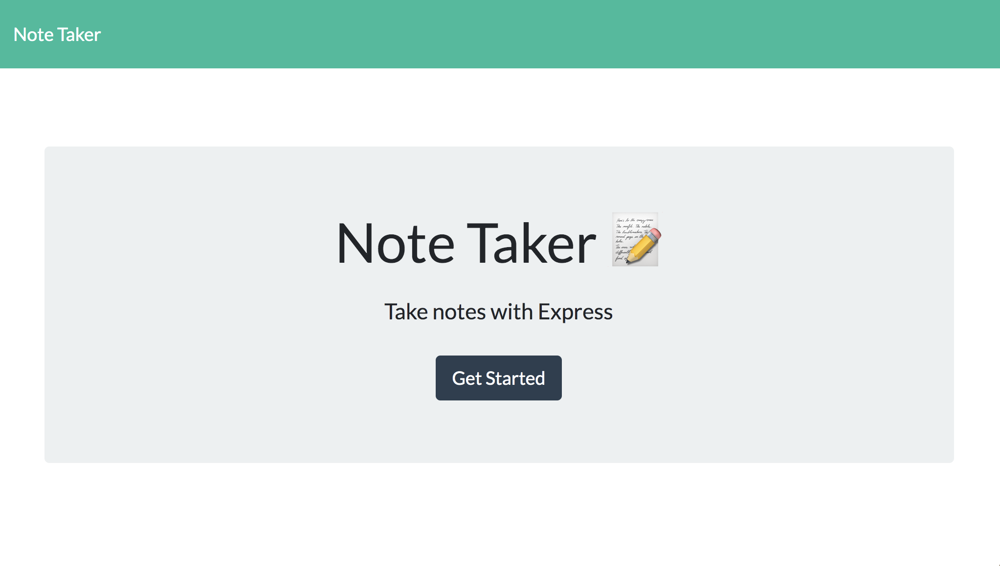
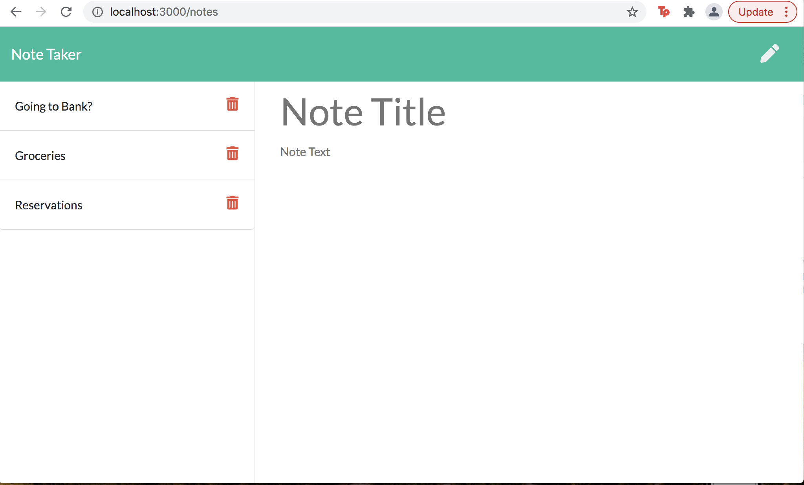

# Note Taker

## Description

  A note taking application built with Express.js

## Table of Contents
  * [Technology](#technology)
  * [Installation](#installation)
  * [Usage](#usage)
  * [Links](#links)
  * [License](#license)
  * [Tests](#tests)
  * [Questions](#questions)
  * [Contributions](#contributions)
  

## Technology

  This application was built with the following technology:

  Express.js

  Node.js

  JavaScript

  BootStrap

  NPM Inquirer  

  HTML

  CSS

  
  
## Installation

  Clone the repo / copy the code.

## Usage

  After cloning or copying, run npm i and npm mysql in your terminal at the root to install any requirements. Run node server.js to run start the application. 

 
 
 
 
  

 ## Links
 
  * Application URL: (https://jsnoter.herokuapp.com/)
  * Github Repository URL: (https://github.com/fjimenez51/MyNote-Taker)
  * Deployed Github URL: (https://fjimenez51.github.io/MyNote-Taker/)
  

## License

  

## Tests

  There are no tests associated with application 

## Contact

  [![GitHub]](https://github.com/fjimenez51) 
  [

  ## Contributions

  [
  

  
  
  
  
  d

  
  
